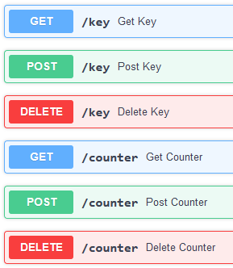

# cs2105-tcp-testkit

just an interface to send tcp packets to your cs2105 assignment 1 app. now you won't misspell queries and have to debug!

### how to use?
either you can download the executable then jump to step 4 or:

1. clone the repository
2. have python (works on 3.12.2) (hopefully you know venv)
3. run `python main.py`
4. go to http://127.0.0.1:8000/docs/ (default)
5. set the port that your server is running on, and check it if you wish by clicking the "Try it out" button

6. do your get/post/delete queries

### notes
- the client closes the connection on every query, so this will not help you test persistence, sadly.
- it helps you test response correctness though!
- i didn't compile a mac executable because i just broke my macbook (and too lazy to configure cross compilation)